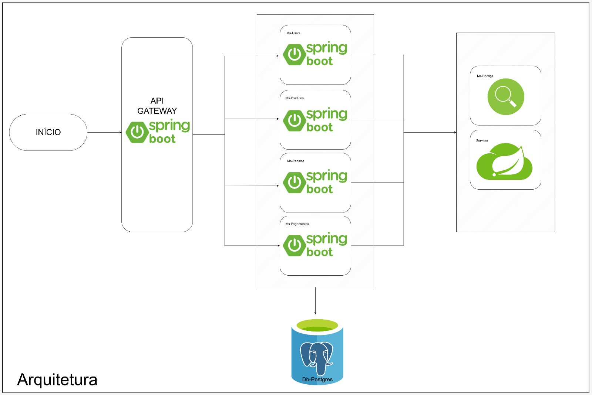
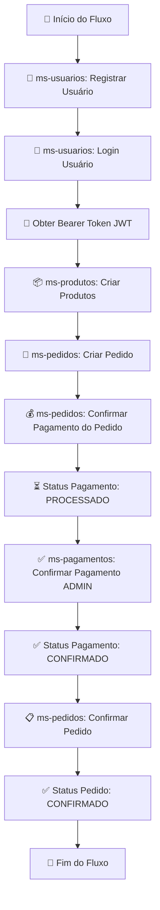

# 🛒 E-Commerce Microservices Platform

<div align="center">


**Plataforma de E-Commerce desenvolvida com arquitetura de microsserviços**

[Características](#-características-principais) •
[Arquitetura](#-arquitetura-do-sistema) •
[Tecnologias](#-stack-tecnológico) •
[Instalação](#-instalação-e-configuração) •
[Docker](#-docker-e-containerização) •
[Endpoints](#-documentação-de-endpoints) •
[Segurança](#-sistema-de-autenticação-e-autorização)

</div>

---

## 📋 Índice

- [Visão Geral](#-visão-geral)
- [Características Principais](#-características-principais)
- [Arquitetura do Sistema](#-arquitetura-do-sistema)
- [Stack Tecnológico](#-stack-tecnológico)
- [Microserviços](#-microserviços)
- [Instalação e Configuração](#-instalação-e-configuração)
- [Docker e Containerização](#-docker-e-containerização)
- [Documentação de Endpoints](#-documentação-de-endpoints)
- [Sistema de Autenticação](#-sistema-de-autenticação-e-autorização)
- [Fluxo de Dados](#-fluxo-de-dados)
- [Testes](#-testes)
- [Roadmap](#-roadmap)
- [Contribuição](#-contribuição)
- [Licença](#-licença)

---

## 🎯 Visão Geral

Este projeto implementa uma **plataforma completa de e-commerce** utilizando **arquitetura de microsserviços**, desenvolvida com **Spring Boot 3.5.5** e **Spring Cloud**. O sistema é projetado para ser **escalável**, **resiliente** e **facilmente mantível**, seguindo as melhores práticas de desenvolvimento de software moderno.

### 🎨 Principais Diferenciais

- ✅ **Arquitetura de Microsserviços** com separação clara de responsabilidades
- ✅ **Comunicação Assíncrona** via RabbitMQ para operações críticas
- ✅ **Service Discovery** automático com Eureka
- ✅ **API Gateway** centralizado com validação JWT
- ✅ **Autenticação JWT** stateless com controle de roles (USER/ADMIN)
- ✅ **Ownership Validation** para controle granular de acesso
- ✅ **HATEOAS** para navegação intuitiva entre recursos
- ✅ **Database Isolation** com PostgreSQL dedicado
- ✅ **Circuit Breaker** e resiliência com Feign Client
- ✅ **Logging Centralizado** e rastreamento de requisições

---

## ⭐ Características Principais

### 🔐 Segurança Robusta
- Autenticação JWT com tokens de longa duração
- Controle de acesso baseado em roles (RBAC)
- Validação de propriedade de recursos (ownership)
- Proteção contra CORS
- Headers de segurança customizados

### 🚀 Alta Performance
- Comunicação assíncrona para operações pesadas
- Cache de descoberta de serviços
- Load balancing automático via Eureka
- Processamento paralelo com RabbitMQ

### 🔄 Escalabilidade
- Microserviços independentes e desacoplados
- Fácil adição de novas instâncias
- Stateless design para horizontal scaling
- Database isolation por domínio

### 📊 Observabilidade
- Logs estruturados com contexto de usuário
- Rastreamento de requisições entre serviços
- Health checks em todos os serviços
- Monitoramento via Spring Actuator

---

## 🏗️ Arquitetura do Sistema

### Visão Geral da Arquitetura



```
┌─────────────┐
│   Cliente   │
└──────┬──────┘
       │ HTTP/REST
       ▼
┌─────────────────┐
│  API Gateway    │ ◄─── JWT Authentication
│  (Port 8082)    │ ◄─── CORS Configuration
└────────┬────────┘
         │
         ├─── Eureka Service Discovery ───┐
         │                                │
    ┌────▼────────┬───────────┬──────────┬▼────────┐
    │ ms-usuarios │ms-produtos│ms-pedidos│ms-pagam.│
    └─────────────┴───────────┴──────────┴─────────┘
         │            │           │           │
         └────────────┴───────────┴───────────┘
                      │
              ┌───────▼────────┐
              │   ms-database  │
              └───────┬────────┘
                      │
              ┌───────▼────────┐
              │   PostgreSQL   │
              └────────────────┘
```

### 📊 Fluxo de Comunicação

### Fluxo de Processamento de Pedidos


1. **Cliente → API Gateway**: Cliente envia requisição com JWT token
2. **Gateway → Validação**: Gateway valida token e extrai informações do usuário
3. **Gateway → Microserviço**: Gateway roteia para o microserviço apropriado via Eureka
4. **Microserviço → RabbitMQ**: Operações assíncronas são publicadas em filas
5. **RabbitMQ → Database**: Database consome mensagens e persiste dados
6. **Database → PostgreSQL**: Dados são armazenados no banco de dados
7. **Resposta**: Microserviço retorna resposta ao cliente via Gateway

---

## 🛠️ Stack Tecnológico

### Backend Framework
| Tecnologia | Versão | Descrição |
|-----------|--------|-----------|
| **Java** | 17 (LTS) | Linguagem de programação principal |
| **Spring Boot** | 3.5.5 | Framework para construção de aplicações |
| **Spring Cloud** | 2025.0.0 | Ferramentas para sistemas distribuídos |
| **Spring Security** | 6.x | Framework de segurança e autenticação |
| **Spring Data JPA** | 3.x | Abstração para acesso a dados |

### Microserviços & Cloud
| Tecnologia | Versão | Uso |
|-----------|--------|-----|
| **Spring Cloud Gateway** | 4.3.1 | API Gateway reativo |
| **Netflix Eureka** | 4.3.0 | Service Discovery & Registration |
| **OpenFeign** | 4.x | Cliente HTTP declarativo |
| **Resilience4j** | - | Circuit Breaker & Fault Tolerance |

### Segurança
| Tecnologia | Versão | Uso |
|-----------|--------|-----|
| **JJWT** | 0.12.6 | Geração e validação de JWT tokens |
| **BCrypt** | - | Hash de senhas |
| **Spring Security** | 6.x | Autenticação e autorização |

### Banco de Dados & Mensageria
| Tecnologia | Versão | Uso |
|-----------|--------|-----|
| **PostgreSQL** | 15+ | Banco de dados relacional |
| **RabbitMQ** | 3.x | Message Broker para comunicação assíncrona |
| **Hibernate** | 6.x | ORM (Object-Relational Mapping) |

### Ferramentas & Bibliotecas
| Tecnologia | Uso |
|-----------|-----|
| **Lombok** | Redução de boilerplate code |
| **ModelMapper** | Mapeamento de DTOs |
| **HATEOAS** | Links de navegação em respostas REST |
| **Bean Validation** | Validação de dados |
| **Spring Actuator** | Monitoramento e health checks |

---

## 📋 Gestão de Projeto

### 🗂️ Trello Board

O projeto foi gerenciado utilizando **Trello** para organização de tarefas, acompanhamento de progresso e planejamento de sprints.

**Quadros Utilizados:**

| Coluna | Descrição |
|--------|-----------|
| 📝 **Backlog** | Funcionalidades planejadas |
| 🚧 **Em Desenvolvimento** | Tarefas em andamento |
| 🧪 **Em Testes** | Features sendo testadas |
| ✅ **Concluído** | Funcionalidades finalizadas |
| 🐛 **Bugs** | Problemas identificados |
| 📚 **Documentação** | Docs e guias |

---

## 🔧 Microserviços

### 1️⃣ API Gateway (Port 8082)
**Responsabilidade**: Ponto de entrada único para todas as requisições

**Funcionalidades**:
- ✅ Validação centralizada de tokens JWT
- ✅ Roteamento inteligente para microserviços via Eureka
- ✅ Propagação de headers de autenticação (`X-User-Id`, `X-User-Role`, `X-User-Email`)
- ✅ Configuração de CORS
- ✅ Load balancing automático
- ✅ Endpoints públicos sem autenticação (`/auth/**`)

**Rotas**:
```
/ms-usuarios/**   → ms-usuarios   (Auth & User Management)
/ms-produtos/**   → ms-produtos   (Product Catalog)
/ms-pedidos/**    → ms-pedidos    (Order Management)
/ms-pagamentos/** → ms-pagamentos (Payment Processing)
```

---

### 2️⃣ ms-usuarios
**Responsabilidade**: Autenticação, autorização e gerenciamento de usuários

**Funcionalidades**:
- 🔐 Login e registro de usuários
- 🎫 Geração de tokens JWT
- 👥 CRUD completo de usuários
- 🛡️ Controle de roles (USER, ADMIN)
- ✅ Ownership validation

**Acesso via API Gateway**:
```
http://localhost:8082/ms-usuarios/**
```

**Endpoints Principais** (via Gateway):
```http
POST   http://localhost:8082/ms-usuarios/auth/register           # Registro (público)
POST   http://localhost:8082/ms-usuarios/auth/login              # Login (público)
GET    http://localhost:8082/ms-usuarios/usuarios                # Listar todos (ADMIN)
GET    http://localhost:8082/ms-usuarios/usuarios/{id}           # Buscar por ID (Owner/ADMIN)
GET    http://localhost:8082/ms-usuarios/usuarios/email/{email}  # Buscar por email (autenticado)
POST   http://localhost:8082/ms-usuarios/usuarios                # Criar usuário (ADMIN)
PUT    http://localhost:8082/ms-usuarios/usuarios/update/{id}    # Atualizar (Owner/ADMIN)
DELETE http://localhost:8082/ms-usuarios/usuarios/delete/{id}    # Deletar (ADMIN)
```

**Comunicação**:
- 📤 Publica `usuarios.criados` no RabbitMQ
- 📤 Publica `usuarios.atualizados` no RabbitMQ

---

### 3️⃣ ms-produtos 
**Responsabilidade**: Gerenciamento de catálogo de produtos

**Funcionalidades**:
- 📦 CRUD de produtos
- 🔍 Listagem pública de produtos
- 📝 Criação em lote (batch)
- 🛡️ Modificações apenas para ADMIN

**Acesso via API Gateway**:
```
http://localhost:8082/ms-produtos/**
```

**Endpoints Principais** (via Gateway):
```http
GET    http://localhost:8082/ms-produtos/produtos              # Listar todos (público)
GET    http://localhost:8082/ms-produtos/produtos/{id}         # Buscar por ID (público)
POST   http://localhost:8082/ms-produtos/produtos              # Criar produto (ADMIN)
POST   http://localhost:8082/ms-produtos/produtos/batch        # Criar múltiplos (ADMIN)
PUT    http://localhost:8082/ms-produtos/produtos/update/{id}  # Atualizar (ADMIN)
DELETE http://localhost:8082/ms-produtos/produtos/delete/{id}  # Deletar (ADMIN)
```

**Regra de Negócio**:
- ✅ **GET**: Acesso público (sem autenticação)
- 🔒 **POST/PUT/DELETE**: Apenas ADMIN

**Comunicação**:
- 📤 Publica `produtos.criados` no RabbitMQ
- 📤 Publica `produtos.atualizados` no RabbitMQ
- 📤 Publica `produtos.deletados` no RabbitMQ

---

### 4️⃣ ms-pedidos
**Responsabilidade**: Gerenciamento de pedidos (orders)

**Funcionalidades**:
- 🛒 Criação de pedidos
- 📋 Listagem com filtro por usuário
- 🔒 Ownership validation complexa
- ✅ Confirmação de pedidos
- 💳 Associação de pagamentos
- ❌ Cancelamento de pedidos

**Acesso via API Gateway**:
```
http://localhost:8082/ms-pedidos/**
```

**Endpoints Principais** (via Gateway):
```http
GET    http://localhost:8082/ms-pedidos/pedidos                        # Listar (USER: próprios | ADMIN: todos)
GET    http://localhost:8082/ms-pedidos/pedidos/{id}                   # Buscar por ID (Owner/ADMIN)
GET    http://localhost:8082/ms-pedidos/pedidos/user/{id}              # Pedidos de um usuário (Owner/ADMIN)
POST   http://localhost:8082/ms-pedidos/pedidos                        # Criar pedido (autenticado)
PUT    http://localhost:8082/ms-pedidos/pedidos/update/{id}            # Atualizar (Owner/ADMIN)
PATCH  http://localhost:8082/ms-pedidos/pedidos/{id}/confirmarPedido   # Confirmar pedido (Owner/ADMIN)
POST   http://localhost:8082/ms-pedidos/pedidos/{id}/pagamento         # Adicionar pagamento (Owner/ADMIN)
DELETE http://localhost:8082/ms-pedidos/pedidos/delete/{id}            # Deletar (Owner/ADMIN)
PATCH  http://localhost:8082/ms-pedidos/pedidos/cancelarPedido/{id}    # Cancelar (Owner/ADMIN)
```

**Regras de Negócio**:
- 🔒 **Ownership Validation**: USER vê apenas seus pedidos
- 👑 **ADMIN Bypass**: ADMIN acessa todos os pedidos
- 🔗 **Feign Client**: Busca dados de usuários via ms-usuarios

**Comunicação**:
- 📤 Publica `pedidos.novos` no RabbitMQ
- 📤 Publica `pedidos.confirmados` no RabbitMQ
- 📤 Publica `pedidos.cancelados` no RabbitMQ
- 🔗 Consome dados de `ms-usuarios` via Feign

---

### 5️⃣ ms-pagamentos (Porta interna: 8086)
**Responsabilidade**: Processamento de pagamentos

**Funcionalidades**:
- 💰 CRUD de pagamentos
- 💳 Tipos de pagamento (BOLETO, PIX, CARTAO, etc.)
- ✅ Confirmação de pagamentos
- 🔒 Acesso exclusivo para ADMIN

**Acesso via API Gateway**:
```
http://localhost:8082/ms-pagamentos/**
```

**Endpoints Principais** (via Gateway):
```http
GET    http://localhost:8082/ms-pagamentos/pagamentos                   # Listar todos (ADMIN)
GET    http://localhost:8082/ms-pagamentos/pagamentos/{id}              # Buscar por ID (ADMIN)
GET    http://localhost:8082/ms-pagamentos/pagamentos/pedido/{idPedido} # Buscar por pedido (ADMIN)
POST   http://localhost:8082/ms-pagamentos/pagamentos/pedido/create     # Criar pagamento (ADMIN)
PUT    http://localhost:8082/ms-pagamentos/pagamentos/update/{id}       # Atualizar (ADMIN)
PATCH  http://localhost:8082/ms-pagamentos/pagamentos/{id}/confirmar    # Confirmar pagamento (ADMIN)
DELETE http://localhost:8082/ms-pagamentos/pagamentos/delete/{id}       # Deletar (ADMIN)
```

**Regra de Negócio**:
- 🔒 **Admin Only**: Todas operações restritas a ADMIN
- 💼 **Razão**: Operações financeiras sensíveis

**Comunicação**:
- 📤 Publica `pagamentos.processados` no RabbitMQ
- 📤 Publica `pagamentos.confirmados` no RabbitMQ

---

### 6️⃣ ms-database
**Responsabilidade**: Persistência de dados e acesso ao banco PostgreSQL

**Funcionalidades**:
- 💾 Persistência de todas as entidades
- 🔄 Listeners RabbitMQ para operações assíncronas
- 📊 Repositories JPA
- 🔗 Endpoints REST para acesso direto (interno)

**Entidades**:
- `Usuarios` (id, nome, email, senha, telefone, role)
- `Produtos` (id, nome, descricao, preco, quantidade)
- `Pedidos` (id, usuario, itens, status, dataCriacao)
- `ItemDoPedido` (id, pedido, produto, quantidade, preco)
- `Pagamento` (id, pedido, valor, tipoPagamento, status)

**RabbitMQ Listeners**:
- `UsuariosListener`: Queues e DLQs.
- `ProdutosListener`: Queues e DLQs.
- `PedidosListener`: Queues e DLQs.
- `PagamentoListener`: Queues e DLQs.

**Comunicação**:
- 📥 Consome mensagens de todos os microserviços
- 💾 Persiste dados no PostgreSQL

---

### 7️⃣ server (Eureka Server - Port 8081)
**Responsabilidade**: Service Discovery e registro de microserviços

**Funcionalidades**:
- 🔍 Descoberta automática de serviços
- ❤️ Health checks de microserviços
- 🔄 Load balancing coordination
- 📊 Dashboard de monitoramento

**Dashboard**: http://localhost:8081

---

### 8️⃣ common-dtos (Biblioteca Compartilhada)
**Responsabilidade**: DTOs compartilhados entre microserviços

**Classes**:
```java
- Role
- UsuariosDTO
- ProdutosDTO
- PedidosDTO
- PagamentoDTO
- Enums
  - StatusPagamento
  - StatusPedidos
  - TipoFormaPagamento
- ItemDoPedidoDTO
- PagamentoPedidoUpdateDTO
- ProdutoIdDTO
- UsuarioIdDTO
- LoginRequestDTO
- LoginResponseDTO
- RegisterRequestDTO
```

**Benefício**: Evita duplicação de código e garante consistência

---

## 📥 Instalação e Configuração

### Pré-requisitos

| Software | Versão Mínima | Download |
|----------|---------------|----------|
| **Java JDK** | 17+ | [Oracle JDK](https://www.oracle.com/java/technologies/javase/jdk17-archive-downloads.html) ou [OpenJDK](https://openjdk.org/) |
| **Maven** | 3.8+ | [Apache Maven](https://maven.apache.org/download.cgi) |
| **PostgreSQL** | 15+ | [PostgreSQL](https://www.postgresql.org/download/) |
| **RabbitMQ** | 3.x+ | [RabbitMQ](https://www.rabbitmq.com/download.html) |
| **Git** | 2.x+ | [Git](https://git-scm.com/downloads) |

### 1️⃣ Clonar o Repositório

```bash
git clone https://github.com/ThallysCezar/Project-Ecommerce-Microsservices.git
cd Project-Ecommerce-Microsservices
```

### 2️⃣ Configurar PostgreSQL

```sql
-- Conectar ao PostgreSQL
psql -U postgres

-- Criar banco de dados
CREATE DATABASE postgres;

-- Configurar usuário (opcional)
CREATE USER ecommerce WITH PASSWORD '123456';
GRANT ALL PRIVILEGES ON DATABASE postgres TO ecommerce;
```

### 3️⃣ Configurar RabbitMQ

```bash
# Iniciar RabbitMQ
# Windows
rabbitmq-server.bat

# Linux/Mac
rabbitmq-server

# Acessar dashboard
http://localhost:15672
# Usuário: guest
# Senha: guest
```

### 4️⃣ Configurar Variáveis de Ambiente (Opcional)

Você pode personalizar as configurações criando um arquivo `.env` ou editando os `application.properties`:

```properties
# ms-database/src/main/resources/application.properties
spring.datasource.url=jdbc:postgresql://localhost:5432/postgres
spring.datasource.username=postgres
spring.datasource.password=123456

spring.rabbitmq.host=localhost
spring.rabbitmq.port=5672
spring.rabbitmq.username=guest
spring.rabbitmq.password=guest

# Todos os microserviços
jwt.secret=minha-chave-secreta-super-segura-para-jwt-com-minimo-256-bits-de-seguranca
jwt.expiration=86400000
```

### 5️⃣ Compilar Todos os Projetos

```bash
# Compilar common-dtos primeiro (dependência)
cd common-dtos
mvn clean install

# Voltar à raiz
cd ..

# Compilar todos os microserviços
mvn clean package -DskipTests
```

### 6️⃣ Iniciar os Serviços (ORDEM IMPORTANTE)

```powershell
# 1. Eureka Server (Service Discovery)
cd server
java -jar target/server-0.0.1-SNAPSHOT.jar

# 2. ms-database (Database Service)
cd ../ms-database
java -jar target/ms-database-0.0.1-SNAPSHOT.jar

# 3. API Gateway
cd ../api-gateway
java -jar target/api-gateway-0.0.1-SNAPSHOT.jar

# 4. ms-usuarios (Authentication)
cd ../ms-usuarios
java -jar target/ms-usuarios-0.0.1-SNAPSHOT.jar

# 5. ms-produtos
cd ../ms-produtos
java -jar target/ms-produtos-0.0.1-SNAPSHOT.jar

# 6. ms-pedidos
cd ../ms-pedidos
java -jar target/ms-pedidos-0.0.1-SNAPSHOT.jar

# 7. ms-pagamentos
cd ../ms-pagamentos
java -jar target/ms-pagamentos-0.0.1-SNAPSHOT.jar
```

### 7️⃣ Verificar Serviços

Aguarde todos os serviços se registrarem no Eureka (~1-2 minutos):

**Dashboard de Monitoramento**:
- **Eureka Dashboard**: http://localhost:8081 (veja todos os serviços registrados)
- **RabbitMQ Management**: http://localhost:15672 (filas e mensagens)

**Health Checks via API Gateway** (porta única de acesso):
- **API Gateway**: http://localhost:8082/actuator/health
- **ms-usuarios**: http://localhost:8082/ms-usuarios/actuator/health
- **ms-produtos**: http://localhost:8082/ms-produtos/actuator/health
- **ms-pedidos**: http://localhost:8082/ms-pedidos/actuator/health
- **ms-pagamentos**: http://localhost:8082/ms-pagamentos/actuator/health

**Health Check Direto** (apenas para debug - não use em produção):
- **ms-database**: http://localhost:8080/actuator/health

> **💡 Nota Importante**: Em produção, **todos os acessos devem passar pelo API Gateway (8082)**. As portas individuais dos microserviços (8080, 8083-8086) devem estar bloqueadas no firewall e acessíveis apenas internamente via Eureka.

✅ **Sistema pronto para uso!**

---

## � Docker e Containerização

### 📦 Executar com Docker Compose (Recomendado)

A forma mais rápida de rodar toda a aplicação é usando Docker Compose:

```bash
# Na raiz do projeto
docker-compose up -d
```

Este comando irá:
- ✅ Construir as imagens Docker de todos os microsserviços
- ✅ Iniciar PostgreSQL e RabbitMQ automaticamente
- ✅ Configurar a rede entre os containers
- ✅ Aguardar a ordem correta de inicialização (health checks)

### 🔍 Verificar Status dos Containers

```bash
# Ver todos os containers em execução
docker-compose ps

# Ver logs de todos os serviços
docker-compose logs -f

# Ver logs de um serviço específico
docker-compose logs -f ms-usuarios
```

### 🛑 Parar os Serviços

```bash
# Parar todos os containers
docker-compose down

# Parar e remover volumes (limpar banco de dados)
docker-compose down -v
```

### 📋 Estrutura Docker

Cada microsserviço possui seu próprio `Dockerfile`:

```
├── api-gateway/Dockerfile
├── ms-usuarios/Dockerfile
├── ms-produtos/Dockerfile
├── ms-pedidos/Dockerfile
├── ms-pagamentos/Dockerfile
├── ms-database/Dockerfile
├── server/Dockerfile (Eureka)
├── ms-configs/Dockerfile (Config Server)
└── docker-compose.yml (Orquestração completa)
```

### 🌐 Acessar a Aplicação

Após ~2 minutos, todos os serviços estarão disponíveis:

- **API Gateway**: http://localhost:8082
- **Eureka Dashboard**: http://localhost:8081
- **RabbitMQ Management**: http://localhost:15672 (guest/guest)
- **PostgreSQL**: localhost:5432

### 📖 Documentação Docker Completa

Para mais detalhes sobre:
- Construção de imagens individuais
- Variáveis de ambiente
- Troubleshooting
- Configurações avançadas
  
---

## �📚 Documentação de Endpoints

### 🔓 Autenticação (Endpoints Públicos)

#### Registrar Novo Usuário

```http
POST http://localhost:8082/ms-usuarios/auth/register
Content-Type: application/json

{
  "nome": "João Silva",
  "email": "joao@example.com",
  "password": "senha123",
  "telefone": "11987654321",
  "role": "USER"
}
```

**Resposta** (201 Created):
```json
{
  "token": "eyJhbGciOiJIUzI1NiJ9.eyJzdWIiOiJqb2FvQGV4YW1wbGUuY29tIiwiaWQiOjEsInJvbGUiOiJVU0VSIiwiaWF0IjoxNzM0NzM0MDAwLCJleHAiOjE3MzQ4MjA0MDB9.signature",
  "type": "Bearer",
  "userId": 1,
  "userName": "João Silva",
  "email": "joao@example.com",
  "role": "USER"
}
```

#### Login

```http
POST http://localhost:8082/ms-usuarios/auth/login
Content-Type: application/json

{
  "email": "joao@example.com",
  "password": "senha123"
}
```

**Resposta** (200 OK):
```json
{
  "token": "eyJhbGciOiJIUzI1NiJ9...",
  "type": "Bearer",
  "userId": 1,
  "userName": "João Silva",
  "email": "joao@example.com",
  "role": "USER"
}
```

---

### 👤 Usuários (Autenticação Necessária)

#### Listar Todos os Usuários (ADMIN)

```http
GET http://localhost:8082/ms-usuarios/usuarios
Authorization: Bearer {token}
```

#### Buscar Usuário por ID (Owner/ADMIN)

```http
GET http://localhost:8082/ms-usuarios/usuarios/1
Authorization: Bearer {token}
```

#### Atualizar Usuário (Owner/ADMIN)

```http
PUT http://localhost:8082/ms-usuarios/usuarios/update/1
Authorization: Bearer {token}
Content-Type: application/json

{
  "nome": "João Silva Atualizado",
  "telefone": "11999999999"
}
```

#### Deletar Usuário (ADMIN)

```http
DELETE http://localhost:8082/ms-usuarios/usuarios/delete/1
Authorization: Bearer {token_admin}
```

---

### 📦 Produtos

#### Listar Produtos (Público)

```http
GET http://localhost:8082/ms-produtos/produtos
```

**Resposta**:
```json
[
  {
    "id": 1,
    "nome": "Notebook Dell",
    "descricao": "Notebook Dell Inspiron 15",
    "preco": 3500.00,
    "quantidade": 10
  },
  {
    "id": 2,
    "nome": "Mouse Logitech",
    "descricao": "Mouse sem fio",
    "preco": 150.00,
    "quantidade": 50
  }
]
```

#### Criar Produto (ADMIN)

```http
POST http://localhost:8082/ms-produtos/produtos
Authorization: Bearer {token_admin}
Content-Type: application/json

{
  "nome": "Teclado Mecânico",
  "descricao": "Teclado mecânico RGB",
  "preco": 450.00,
  "quantidade": 20
}
```

#### Criar Múltiplos Produtos (ADMIN)

```http
POST http://localhost:8082/ms-produtos/produtos/batch
Authorization: Bearer {token_admin}
Content-Type: application/json

[
  {
    "nome": "Monitor LG 24''",
    "descricao": "Monitor Full HD",
    "preco": 800.00,
    "quantidade": 15
  },
  {
    "nome": "Webcam Logitech",
    "descricao": "Webcam HD",
    "preco": 250.00,
    "quantidade": 30
  }
]
```

#### Atualizar Produto (ADMIN)

```http
PUT http://localhost:8082/ms-produtos/produtos/update/1
Authorization: Bearer {token_admin}
Content-Type: application/json

{
  "nome": "Notebook Dell Atualizado",
  "preco": 3200.00,
  "quantidade": 5
}
```

#### Deletar Produto (ADMIN)

```http
DELETE http://localhost:8082/ms-produtos/produtos/delete/1
Authorization: Bearer {token_admin}
```

---

### 🛒 Pedidos

#### Listar Pedidos (USER: próprios | ADMIN: todos)

```http
GET http://localhost:8082/ms-pedidos/pedidos
Authorization: Bearer {token}
```

**Resposta (USER)**:
```json
[
  {
    "id": 1,
    "usuario": {
      "id": 1,
      "nome": "João Silva",
      "email": "joao@example.com"
    },
    "itens": [
      {
        "id": 1,
        "produto": {
          "id": 1,
          "nome": "Notebook Dell",
          "preco": 3500.00
        },
        "quantidade": 1,
        "preco": 3500.00
      }
    ],
    "status": "PENDENTE",
    "dataCriacao": "2024-01-20T10:00:00"
  }
]
```

#### Buscar Pedido por ID (Owner/ADMIN)

```http
GET http://localhost:8082/ms-pedidos/pedidos/1
Authorization: Bearer {token}
```

#### Criar Pedido (Autenticado)

```http
POST http://localhost:8082/ms-pedidos/pedidos
Authorization: Bearer {token}
Content-Type: application/json

{
  "usuario": {
    "id": 1
  },
  "itens": [
    {
      "produto": {
        "id": 1
      },
      "quantidade": 2,
      "preco": 3500.00
    },
    {
      "produto": {
        "id": 2
      },
      "quantidade": 1,
      "preco": 150.00
    }
  ]
}
```

**Resposta com HATEOAS**:
```json
{
  "pedido": {
    "id": 1,
    "usuario": {...},
    "itens": [...],
    "status": "PENDENTE"
  },
  "message": "Pedido criado com sucesso!",
  "_links": {
    "processar-pagamento-boleto": {
      "href": "http://localhost:8082/ms-pedidos/pedidos/1/pagamento",
      "title": "POST - Processar pagamento via BOLETO"
    },
    "processar-pagamento-pix": {
      "href": "http://localhost:8082/ms-pedidos/pedidos/1/pagamento",
      "title": "POST - Processar pagamento via PIX"
    },
    "confirmar-pedido": {
      "href": "http://localhost:8082/ms-pedidos/pedidos/1/confirmarPedido",
      "title": "PATCH - Confirmar o pedido"
    }
  }
}
```

#### Confirmar Pedido (Owner/ADMIN)

```http
PATCH http://localhost:8082/ms-pedidos/pedidos/1/confirmarPedido
Authorization: Bearer {token}
```

#### Adicionar Pagamento ao Pedido (Owner/ADMIN)

```http
POST http://localhost:8082/ms-pedidos/pedidos/1/pagamento
Authorization: Bearer {token}
Content-Type: application/json

{
  "valor": 7150.00,
  "tipoPagamento": "BOLETO"
}
```

**Tipos de Pagamento Aceitos**:
- `BOLETO`
- `PIX`
- `CARTAO_CREDITO`
- `CARTAO_DEBITO`

#### Cancelar Pedido (Owner/ADMIN)

```http
PATCH http://localhost:8082/ms-pedidos/pedidos/cancelarPedido/1
Authorization: Bearer {token}
```

---

### 💳 Pagamentos (ADMIN Only)

#### Listar Todos os Pagamentos (ADMIN)

```http
GET http://localhost:8082/ms-pagamentos/pagamentos
Authorization: Bearer {token_admin}
```

#### Buscar Pagamento por ID (ADMIN)

```http
GET http://localhost:8082/ms-pagamentos/pagamentos/1
Authorization: Bearer {token_admin}
```

#### Buscar Pagamentos de um Pedido (ADMIN)

```http
GET http://localhost:8082/ms-pagamentos/pagamentos/pedido/1
Authorization: Bearer {token_admin}
```

#### Confirmar Pagamento (ADMIN)

```http
PATCH http://localhost:8082/ms-pagamentos/pagamentos/1/confirmar
Authorization: Bearer {token_admin}
```

---

## 🔐 Sistema de Autenticação e Autorização

### 🎫 JWT (JSON Web Tokens)

O sistema utiliza **JWT stateless** para autenticação. Cada token contém:

```json
{
  "sub": "joao@example.com",
  "id": 1,
  "role": "USER",
  "iat": 1734734000,
  "exp": 1734820400
}
```

**Configuração**:
- **Algoritmo**: HS256 (HMAC-SHA256)
- **Secret Key**: Compartilhada entre todos os microserviços
- **Expiração**: 24 horas (86400000 ms)

### 👥 Roles e Permissões

| Role | Descrição | Permissões |
|------|-----------|------------|
| **USER** | Usuário comum | • Ver próprios dados<br>• Criar pedidos<br>• Ver próprios pedidos<br>• Ver produtos (público) |
| **ADMIN** | Administrador | • Todas permissões de USER<br>• Gerenciar usuários<br>• Gerenciar produtos<br>• Ver todos pedidos<br>• Gerenciar pagamentos |

### 🔒 Ownership Validation

O sistema implementa validação de **propriedade de recursos**:

```java
@PreAuthorize("@ownershipValidator.isOwnerOrAdmin(#id)")
public ResponseEntity<?> updatePedido(@PathVariable Long id) {
    // Apenas o dono do pedido ou ADMIN pode atualizar
}
```

**Lógica**:
1. Extrai `userId` do token JWT
2. Compara com `pedido.usuario.id`
3. Permite se `userId == pedido.usuario.id` OU `role == ADMIN`

### 📊 Matriz de Permissões

| Operação | Público | USER | ADMIN |
|----------|---------|------|-------|
| **Autenticação** |
| Login | ✅ | ✅ | ✅ |
| Registro | ✅ | ✅ | ✅ |
| **Produtos** |
| Listar produtos | ✅ | ✅ | ✅ |
| Ver detalhes | ✅ | ✅ | ✅ |
| Criar produto | ❌ | ❌ | ✅ |
| Atualizar produto | ❌ | ❌ | ✅ |
| Deletar produto | ❌ | ❌ | ✅ |
| **Pedidos** |
| Listar pedidos | ❌ | ✅ (próprios) | ✅ (todos) |
| Ver pedido | ❌ | ✅ (próprio) | ✅ (todos) |
| Criar pedido | ❌ | ✅ | ✅ |
| Atualizar pedido | ❌ | ✅ (próprio) | ✅ (todos) |
| Confirmar pedido | ❌ | ✅ (próprio) | ✅ (todos) |
| Adicionar pagamento | ❌ | ✅ (próprio) | ✅ (todos) |
| Cancelar pedido | ❌ | ✅ (próprio) | ✅ (todos) |
| **Pagamentos** |
| Todas operações | ❌ | ❌ | ✅ |
| **Usuários** |
| Listar usuários | ❌ | ❌ | ✅ |
| Ver próprio perfil | ❌ | ✅ | ✅ |
| Ver outro perfil | ❌ | ❌ | ✅ |
| Atualizar próprio | ❌ | ✅ | ✅ |
| Atualizar outro | ❌ | ❌ | ✅ |
| Deletar usuário | ❌ | ❌ | ✅ |

---

## 🔄 Fluxo de Dados

### 📝 Ciclo Completo de Operação do E-commerce



### 🔢 Passo a Passo Detalhado

#### **1️⃣ Início do Fluxo**
```
Cliente acessa a plataforma de e-commerce
```

---

## 🗺️ Roadmap

### ✅ Concluído

- [x] Arquitetura de microserviços
- [x] Autenticação JWT
- [x] Controle de acesso por roles
- [x] Ownership validation
- [x] Comunicação assíncrona (RabbitMQ)
- [x] Service Discovery (Eureka)
- [x] API Gateway
- [x] HATEOAS links
- [x] Documentação completa
- [x] Swagger/OpenAPI documentation

### 🔄 Em Progresso

- [x] Testes unitários e de integração (59 testes implementados)
- [x] Docker Compose para ambiente completo
- [ ] **CI/CD Pipeline (GitHub Actions)** ⚠️ **[PENDENTE]**
  - Integração Contínua (build, testes, code quality)
  - Deploy Contínuo para ambientes de staging e produção
  - Automação de releases
- [ ] **Kubernetes Deployment** ⚠️ **[PENDENTE]**
  - Manifests YAML para pods, services e deployments
  - Configuração de auto-scaling horizontal
  - Health checks e liveness/readiness probes
  - ConfigMaps e Secrets para configurações
  - Ingress controller para roteamento

### 📋 Próximas Funcionalidades

- [ ] **Refresh Tokens**
  - Tokens de refresh de longa duração
  - Revogação de tokens
  - Blacklist de tokens

- [ ] **Observabilidade**
  - Logging centralizado (ELK Stack)
  - Distributed tracing (Zipkin/Jaeger)
  - Métricas (Prometheus + Grafana)
  - Alertas automatizados

- [ ] **Resiliência**
  - Circuit Breaker (Resilience4j)
  - Rate Limiting
  - Retry policies
  - Timeout configuration

- [ ] **Cache**
  - Redis para cache distribuído
  - Cache de tokens validados
  - Cache de produtos

- [ ] **OAuth2 Social Login**
  - Login com Google
  - Login com GitHub
  - Login com Facebook

- [ ] **Notificações**
  - Email de confirmação de pedido
  - SMS para pagamentos
  - WebSocket para atualizações em tempo real

- [ ] **Admin Dashboard**
  - Interface web para gerenciamento
  - Visualização de métricas
  - Logs de auditoria

- [ ] **Kubernetes Deployment**
  - Helm charts
  - Auto-scaling
  - Service mesh (Istio)

---

## 🤝 Contribuição

Contribuições são bem-vindas! Para contribuir:

1. **Fork** o projeto
2. Crie uma **branch** para sua feature (`git checkout -b feature/MinhaFeature`)
3. **Commit** suas mudanças (`git commit -m 'feat: Adiciona MinhaFeature'`)
4. **Push** para a branch (`git push origin feature/MinhaFeature`)
5. Abra um **Pull Request**

### 📝 Padrões de Commit

Usei [Conventional Commits](https://www.conventionalcommits.org/):

```
feat: Nova funcionalidade
fix: Correção de bug
docs: Documentação
style: Formatação
refactor: Refatoração
test: Testes
chore: Manutenção
```

### 🐛 Reportar Bugs

Abra uma [Issue](https://github.com/ThallysCezar/Project-Ecommerce-Microsservices/issues) com:

- Descrição clara do problema
- Passos para reproduzir
- Comportamento esperado vs atual
- Screenshots (se aplicável)
- Versão do Java, Spring Boot, etc.

---

## 👨‍💻 Autor

**Thallys Cezar**

- GitHub: [@ThallysCezar](https://github.com/ThallysCezar)
- LinkedIn: [Thallys Cezar](https://www.linkedin.com/in/thallyscezar/)

---

<div align="center">

**⭐ Se este projeto foi útil, considere dar uma estrela! ⭐**

[⬆ Voltar ao topo](#-e-commerce-microservices-platform)

</div>
