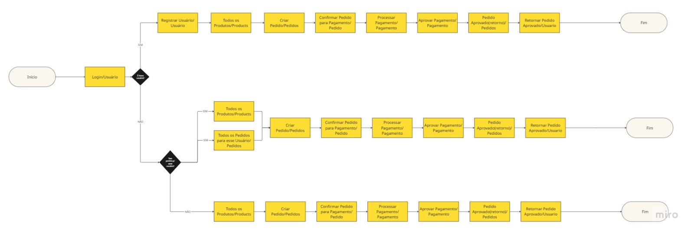

# 🛒 E-Commerce Microservices Platform

<div align="center">


**Plataforma de E-Commerce desenvolvida com arquitetura de microsserviços**

[Características](#-características-principais) •
[Arquitetura](#-arquitetura-do-sistema) •
[Tecnologias](#-stack-tecnológico) •
[Testes](#-testes-automatizados) •
[Docker](#-docker-e-containerização) •
[Kubernetes](#️-kubernetes-deployment) •
[CI/CD](#-cicd-pipeline) •
[Endpoints](#-documentação-de-endpoints)

</div>

---

## 📋 Índice

- [Visão Geral](#-visão-geral)
- [Características Principais](#-características-principais)
- [Arquitetura do Sistema](#-arquitetura-do-sistema)
- [Stack Tecnológico](#-stack-tecnológico)
- [Testes Automatizados](#-testes-automatizados)
- [Gestão de Projeto](#-gestão-de-projeto)
- [Microserviços](#-microserviços)
- [Instalação e Configuração](#-instalação-e-configuração)
- [Docker e Containerização](#-docker-e-containerização)
- [Kubernetes Deployment](#️-kubernetes-deployment)
- [Documentação de Endpoints](#-documentação-de-endpoints)
- [Sistema de Autenticação](#-sistema-de-autenticação-e-autorização)
- [Fluxo de Dados](#-fluxo-de-dados)
- [CI/CD Pipeline](#-cicd-pipeline)
- [Roadmap](#-roadmap)
- [Contribuição](#-contribuição)
- [Licença](#-licença)

---

## 🎯 Visão Geral

Este projeto implementa uma **plataforma completa de e-commerce** utilizando **arquitetura de microsserviços**, desenvolvida com **Spring Boot 3.5.5** e **Spring Cloud**. O sistema é projetado para ser **escalável**, **resiliente** e **facilmente mantível**, seguindo as melhores práticas de desenvolvimento de software moderno.

### 🎨 Principais Diferenciais

- ✅ **Arquitetura de Microsserviços** com separação clara de responsabilidades
- ✅ **Comunicação Assíncrona** via RabbitMQ para operações críticas
- ✅ **Service Discovery** automático com Eureka
- ✅ **API Gateway** centralizado com validação JWT
- ✅ **Autenticação JWT** stateless com controle de roles (USER/ADMIN)
- ✅ **Ownership Validation** para controle granular de acesso
- ✅ **HATEOAS** para navegação intuitiva entre recursos
- ✅ **Database Isolation** com PostgreSQL dedicado
- ✅ **Circuit Breaker** e resiliência com Feign Client
- ✅ **Logging Centralizado** e rastreamento de requisições
- ✅ **Containerização Completa** com Docker e orquestração Kubernetes (K3d)
- ✅ **CI/CD Automatizado** com GitHub Actions
- ✅ **Testes Automatizados** com JUnit 5 e Mockito
- ✅ **Gestão Ágil** com Trello (Scrum/Kanban)

---

## ⭐ Características Principais

### 🔐 Segurança Robusta
- Autenticação JWT com tokens de longa duração
- Controle de acesso baseado em roles (RBAC)
- Validação de propriedade de recursos (ownership)
- Proteção contra CORS
- Headers de segurança customizados

### 🚀 Alta Performance
- Comunicação assíncrona para operações pesadas
- Cache de descoberta de serviços
- Load balancing automático via Eureka
- Processamento paralelo com RabbitMQ

### 🔄 Escalabilidade
- Microserviços independentes e desacoplados
- Fácil adição de novas instâncias
- Stateless design para horizontal scaling
- Database isolation por domínio

### 📊 Observabilidade
- Logs estruturados com contexto de usuário
- Rastreamento de requisições entre serviços
- Health checks em todos os serviços
- Monitoramento via Spring Actuator

### 🐳 DevOps & Cloud Native
- **Docker**: Containerização de todos os microserviços
- **Kubernetes (K3d)**: Orquestração e deployment em cluster local
- **GitHub Actions**: Pipeline de CI/CD automatizado
- **Docker Hub**: Registry centralizado de imagens

### 🧪 Qualidade de Código
- **JUnit 5**: Framework de testes unitários
- **Mockito**: Mocking de dependências
- **Spring Boot Test**: Testes de integração
- **H2 Database**: Banco em memória para testes
- **Test Profiles**: Isolamento de configurações de teste

### 📋 Gestão de Projeto
- **Trello**: Gerenciamento Scrum/Kanban
- **Conventional Commits**: Padronização de commits
- **Documentação**: README completo e guias técnicos

---

## 🏗️ Arquitetura do Sistema

### Visão Geral da Arquitetura


```
┌─────────────┐
│   Cliente   │
└──────┬──────┘
       │ HTTP/REST
       ▼
┌─────────────────┐
│  API Gateway    │ ◄─── JWT Authentication
│  (Port 8082)    │ ◄─── CORS Configuration
└────────┬────────┘
         │
         ├─── Eureka Service Discovery ───┐
         │                                │
    ┌────▼────────┬───────────┬──────────┬▼────────┐
    │ ms-usuarios │ms-produtos│ms-pedidos│ms-pagam.│
    └─────────────┴───────────┴──────────┴─────────┘
         │            │           │           │
         └────────────┴───────────┴───────────┘
                      │
              ┌───────▼────────┐
              │   ms-database  │
              └───────┬────────┘
                      │
              ┌───────▼────────┐
              │   PostgreSQL   │
              └────────────────┘
```

### 📊 Fluxo de Comunicação

### Fluxo de Processamento de Pedidos



1. **Cliente → API Gateway**: Cliente envia requisição com JWT token
2. **Gateway → Validação**: Gateway valida token e extrai informações do usuário
3. **Gateway → Microserviço**: Gateway roteia para o microserviço apropriado via Eureka
4. **Microserviço → RabbitMQ**: Operações assíncronas são publicadas em filas
5. **RabbitMQ → Database**: Database consome mensagens e persiste dados
6. **Database → PostgreSQL**: Dados são armazenados no banco de dados
7. **Resposta**: Microserviço retorna resposta ao cliente via Gateway

---

## 🛠️ Stack Tecnológico

### Backend Framework
| Tecnologia | Versão | Descrição |
|-----------|--------|-----------|
| **Java** | 17 (LTS) | Linguagem de programação principal |
| **Spring Boot** | 3.5.5 | Framework para construção de aplicações |
| **Spring Cloud** | 2025.0.0 | Ferramentas para sistemas distribuídos |
| **Spring Security** | 6.x | Framework de segurança e autenticação |
| **Spring Data JPA** | 3.x | Abstração para acesso a dados |

### Microserviços & Cloud
| Tecnologia | Versão | Uso |
|-----------|--------|-----|
| **Spring Cloud Gateway** | 4.3.1 | API Gateway reativo |
| **Netflix Eureka** | 4.3.0 | Service Discovery & Registration |
| **OpenFeign** | 4.x | Cliente HTTP declarativo |

### Segurança
| Tecnologia | Versão | Uso |
|-----------|--------|-----|
| **JJWT** | 0.12.6 | Geração e validação de JWT tokens |
| **BCrypt** | - | Hash de senhas |
| **Spring Security** | 6.x | Autenticação e autorização |

### Banco de Dados & Mensageria
| Tecnologia | Versão | Uso |
|-----------|--------|-----|
| **PostgreSQL** | 15+ | Banco de dados relacional |
| **H2 Database** | - | Banco em memória para testes |
| **RabbitMQ** | 3.x | Message Broker para comunicação assíncrona |
| **Hibernate** | 6.x | ORM (Object-Relational Mapping) |

### DevOps & Cloud
| Tecnologia | Versão | Uso |
|-----------|--------|-----|
| **Docker** | 24+ | Containerização de aplicações |
| **Docker Compose** | 2.x | Orquestração local de containers |
| **Kubernetes** | K3d | Orquestração e deployment em cluster |
| **GitHub Actions** | - | CI/CD Pipeline automatizado |
| **Docker Hub** | - | Registry de imagens Docker |

### Testes
| Tecnologia | Versão | Uso |
|-----------|--------|-----|
| **JUnit** | 5.x | Framework de testes unitários |
| **Mockito** | 5.x | Mocking de dependências e objetos |
| **Spring Boot Test** | 3.x | Testes de integração |
| **AssertJ** | - | Assertions fluentes |

### Ferramentas & Bibliotecas
| Tecnologia | Uso |
|-----------|-----|
| **Lombok** | Redução de boilerplate code |
| **ModelMapper** | Mapeamento de DTOs |
| **HATEOAS** | Links de navegação em respostas REST |
| **Bean Validation** | Validação de dados |
| **Spring Actuator** | Monitoramento e health checks |

---

## 📋 Gestão de Projeto

### 🗂️ Trello Board

O projeto foi gerenciado utilizando **Trello** para organização de tarefas, acompanhamento de progresso e planejamento de sprints.

**Quadros Utilizados:**

| Coluna | Descrição |
|--------|-----------|
| 📝 **Backlog** | Funcionalidades planejadas |
| 🚧 **Em Desenvolvimento** | Tarefas em andamento |
| 🧪 **Em Testes** | Features sendo testadas |
| ✅ **Concluído** | Funcionalidades finalizadas |
| 🐛 **Bugs** | Problemas identificados |
| 📚 **Documentação** | Docs e guias |

---

## 🔧 Microserviços

### 1️⃣ API Gateway (Port 8082)
**Responsabilidade**: Ponto de entrada único para todas as requisições

**Funcionalidades**:
- ✅ Validação centralizada de tokens JWT
- ✅ Roteamento inteligente para microserviços via Eureka
- ✅ Propagação de headers de autenticação (`X-User-Id`, `X-User-Role`, `X-User-Email`)
- ✅ Configuração de CORS
- ✅ Load balancing automático
- ✅ Endpoints públicos sem autenticação (`/auth/**`)

**Rotas**:
```
/ms-usuarios/**   → ms-usuarios   (Auth & User Management)
/ms-produtos/**   → ms-produtos   (Product Catalog)
/ms-pedidos/**    → ms-pedidos    (Order Management)
/ms-pagamentos/** → ms-pagamentos (Payment Processing)
```

---

### 2️⃣ ms-usuarios
**Responsabilidade**: Autenticação, autorização e gerenciamento de usuários

**Funcionalidades**:
- 🔐 Login e registro de usuários
- 🎫 Geração de tokens JWT
- 👥 CRUD completo de usuários
- 🛡️ Controle de roles (USER, ADMIN)
- ✅ Ownership validation

**Acesso via API Gateway**:
```
http://localhost:8082/ms-usuarios/**
```

**Endpoints Principais** (via Gateway):
```http
POST   http://localhost:8082/ms-usuarios/auth/register           # Registro (público)
POST   http://localhost:8082/ms-usuarios/auth/login              # Login (público)
GET    http://localhost:8082/ms-usuarios/usuarios                # Listar todos (ADMIN)
GET    http://localhost:8082/ms-usuarios/usuarios/{id}           # Buscar por ID (Owner/ADMIN)
GET    http://localhost:8082/ms-usuarios/usuarios/email/{email}  # Buscar por email (autenticado)
POST   http://localhost:8082/ms-usuarios/usuarios                # Criar usuário (ADMIN)
PUT    http://localhost:8082/ms-usuarios/usuarios/update/{id}    # Atualizar (Owner/ADMIN)
DELETE http://localhost:8082/ms-usuarios/usuarios/delete/{id}    # Deletar (ADMIN)
```

**Comunicação**:
- 📤 Publica `usuarios.criados` no RabbitMQ
- 📤 Publica `usuarios.atualizados` no RabbitMQ

---

### 3️⃣ ms-produtos 
**Responsabilidade**: Gerenciamento de catálogo de produtos

**Funcionalidades**:
- 📦 CRUD de produtos
- 🔍 Listagem pública de produtos
- 📝 Criação em lote (batch)
- 🛡️ Modificações apenas para ADMIN

**Acesso via API Gateway**:
```
http://localhost:8082/ms-produtos/**
```

**Endpoints Principais** (via Gateway):
```http
GET    http://localhost:8082/ms-produtos/produtos              # Listar todos (público)
GET    http://localhost:8082/ms-produtos/produtos/{id}         # Buscar por ID (público)
POST   http://localhost:8082/ms-produtos/produtos              # Criar produto (ADMIN)
POST   http://localhost:8082/ms-produtos/produtos/batch        # Criar múltiplos (ADMIN)
PUT    http://localhost:8082/ms-produtos/produtos/update/{id}  # Atualizar (ADMIN)
DELETE http://localhost:8082/ms-produtos/produtos/delete/{id}  # Deletar (ADMIN)
```

**Regra de Negócio**:
- ✅ **GET**: Acesso público (sem autenticação)
- 🔒 **POST/PUT/DELETE**: Apenas ADMIN

**Comunicação**:
- 📤 Publica `produtos.criados` no RabbitMQ
- 📤 Publica `produtos.atualizados` no RabbitMQ
- 📤 Publica `produtos.deletados` no RabbitMQ

---

### 4️⃣ ms-pedidos
**Responsabilidade**: Gerenciamento de pedidos (orders)

**Funcionalidades**:
- 🛒 Criação de pedidos
- 📋 Listagem com filtro por usuário
- 🔒 Ownership validation complexa
- ✅ Confirmação de pedidos
- 💳 Associação de pagamentos
- ❌ Cancelamento de pedidos

**Acesso via API Gateway**:
```
http://localhost:8082/ms-pedidos/**
```

**Endpoints Principais** (via Gateway):
```http
GET    http://localhost:8082/ms-pedidos/pedidos                        # Listar (USER: próprios | ADMIN: todos)
GET    http://localhost:8082/ms-pedidos/pedidos/{id}                   # Buscar por ID (Owner/ADMIN)
GET    http://localhost:8082/ms-pedidos/pedidos/user/{id}              # Pedidos de um usuário (Owner/ADMIN)
POST   http://localhost:8082/ms-pedidos/pedidos                        # Criar pedido (autenticado)
PUT    http://localhost:8082/ms-pedidos/pedidos/update/{id}            # Atualizar (Owner/ADMIN)
PATCH  http://localhost:8082/ms-pedidos/pedidos/{id}/confirmarPedido   # Confirmar pedido (Owner/ADMIN)
POST   http://localhost:8082/ms-pedidos/pedidos/{id}/pagamento         # Adicionar pagamento (Owner/ADMIN)
DELETE http://localhost:8082/ms-pedidos/pedidos/delete/{id}            # Deletar (Owner/ADMIN)
PATCH  http://localhost:8082/ms-pedidos/pedidos/cancelarPedido/{id}    # Cancelar (Owner/ADMIN)
```

**Regras de Negócio**:
- 🔒 **Ownership Validation**: USER vê apenas seus pedidos
- 👑 **ADMIN Bypass**: ADMIN acessa todos os pedidos
- 🔗 **Feign Client**: Busca dados de usuários via ms-usuarios

**Comunicação**:
- 📤 Publica `pedidos.novos` no RabbitMQ
- 📤 Publica `pedidos.confirmados` no RabbitMQ
- 📤 Publica `pedidos.cancelados` no RabbitMQ
- 🔗 Consome dados de `ms-usuarios` via Feign

---

### 5️⃣ ms-pagamentos (Porta interna: 8086)
**Responsabilidade**: Processamento de pagamentos

**Funcionalidades**:
- 💰 CRUD de pagamentos
- 💳 Tipos de pagamento (BOLETO, PIX, CARTAO, etc.)
- ✅ Confirmação de pagamentos
- 🔒 Acesso exclusivo para ADMIN

**Acesso via API Gateway**:
```
http://localhost:8082/ms-pagamentos/**
```

**Endpoints Principais** (via Gateway):
```http
GET    http://localhost:8082/ms-pagamentos/pagamentos                   # Listar todos (ADMIN)
GET    http://localhost:8082/ms-pagamentos/pagamentos/{id}              # Buscar por ID (ADMIN)
GET    http://localhost:8082/ms-pagamentos/pagamentos/pedido/{idPedido} # Buscar por pedido (ADMIN)
POST   http://localhost:8082/ms-pagamentos/pagamentos/pedido/create     # Criar pagamento (ADMIN)
PUT    http://localhost:8082/ms-pagamentos/pagamentos/update/{id}       # Atualizar (ADMIN)
PATCH  http://localhost:8082/ms-pagamentos/pagamentos/{id}/confirmar    # Confirmar pagamento (ADMIN)
DELETE http://localhost:8082/ms-pagamentos/pagamentos/delete/{id}       # Deletar (ADMIN)
```

**Regra de Negócio**:
- 🔒 **Admin Only**: Todas operações restritas a ADMIN
- 💼 **Razão**: Operações financeiras sensíveis

**Comunicação**:
- 📤 Publica `pagamentos.processados` no RabbitMQ
- 📤 Publica `pagamentos.confirmados` no RabbitMQ

---

### 6️⃣ ms-database
**Responsabilidade**: Persistência de dados e acesso ao banco PostgreSQL

**Funcionalidades**:
- 💾 Persistência de todas as entidades
- 🔄 Listeners RabbitMQ para operações assíncronas
- 📊 Repositories JPA
- 🔗 Endpoints REST para acesso direto (interno)

**Entidades**:
- `Usuarios` (id, nome, email, senha, telefone, role)
- `Produtos` (id, nome, descricao, preco, quantidade)
- `Pedidos` (id, usuario, itens, status, dataCriacao)
- `ItemDoPedido` (id, pedido, produto, quantidade, preco)
- `Pagamento` (id, pedido, valor, tipoPagamento, status)

**RabbitMQ Listeners**:
- `UsuariosListener`: Queues e DLQs.
- `ProdutosListener`: Queues e DLQs.
- `PedidosListener`: Queues e DLQs.
- `PagamentoListener`: Queues e DLQs.

**Comunicação**:
- 📥 Consome mensagens de todos os microserviços
- 💾 Persiste dados no PostgreSQL

---

### 7️⃣ server (Eureka Server - Port 8081)
**Responsabilidade**: Service Discovery e registro de microserviços

**Funcionalidades**:
- 🔍 Descoberta automática de serviços
- ❤️ Health checks de microserviços
- 🔄 Load balancing coordination
- 📊 Dashboard de monitoramento

**Dashboard**: http://localhost:8081

---

### 8️⃣ common-dtos (Biblioteca Compartilhada)
**Responsabilidade**: DTOs compartilhados entre microserviços

**Classes**:
```java
- Role
- UsuariosDTO
- ProdutosDTO
- PedidosDTO
- PagamentoDTO
- Enums
  - StatusPagamento
  - StatusPedidos
  - TipoFormaPagamento
- ItemDoPedidoDTO
- PagamentoPedidoUpdateDTO
- ProdutoIdDTO
- UsuarioIdDTO
- LoginRequestDTO
- LoginResponseDTO
- RegisterRequestDTO
```

**Benefício**: Evita duplicação de código e garante consistência

---

## 📥 Instalação e Configuração

### Pré-requisitos

| Software | Versão Mínima | Download |
|----------|---------------|----------|
| **Java JDK** | 17+ | [Oracle JDK](https://www.oracle.com/java/technologies/javase/jdk17-archive-downloads.html) ou [OpenJDK](https://openjdk.org/) |
| **Maven** | 3.8+ | [Apache Maven](https://maven.apache.org/download.cgi) |
| **PostgreSQL** | 15+ | [PostgreSQL](https://www.postgresql.org/download/) |
| **RabbitMQ** | 3.x+ | [RabbitMQ](https://www.rabbitmq.com/download.html) |
| **Git** | 2.x+ | [Git](https://git-scm.com/downloads) |

### 1️⃣ Clonar o Repositório

```bash
git clone https://github.com/ThallysCezar/Project-Ecommerce-Microsservices.git
cd Project-Ecommerce-Microsservices
```

### 2️⃣ Configurar PostgreSQL

```sql
-- Conectar ao PostgreSQL
psql -U postgres

-- Criar banco de dados
CREATE DATABASE postgres;

-- Configurar usuário (opcional)
CREATE USER ecommerce WITH PASSWORD '123456';
GRANT ALL PRIVILEGES ON DATABASE postgres TO ecommerce;
```

### 3️⃣ Configurar RabbitMQ

```bash
# Iniciar RabbitMQ
# Windows
rabbitmq-server.bat

# Linux/Mac
rabbitmq-server

# Acessar dashboard
http://localhost:15672
# Usuário: guest
# Senha: guest
```

### 4️⃣ Configurar Variáveis de Ambiente (Opcional)

Você pode personalizar as configurações criando um arquivo `.env` ou editando os `application.properties`:

```properties
# ms-database/src/main/resources/application.properties
spring.datasource.url=jdbc:postgresql://localhost:5432/postgres
spring.datasource.username=USERNAME
spring.datasource.password=PASSWORD

spring.rabbitmq.host=localhost
spring.rabbitmq.port=5672
spring.rabbitmq.username=guest
spring.rabbitmq.password=guest

# Todos os microserviços
jwt.secret=minha-chave-secreta-super-segura-para-jwt-com-minimo-256-bits-de-seguranca
jwt.expiration=86400000
```

### 5️⃣ Compilar Todos os Projetos

```bash
# Compilar common-dtos primeiro (dependência)
cd common-dtos
mvn clean install

# Voltar à raiz
cd ..

# Compilar todos os microserviços
mvn clean package -DskipTests
```

### 6️⃣ Iniciar os Serviços (ORDEM IMPORTANTE)

```powershell
# 1. Eureka Server (Service Discovery)
cd server
java -jar target/server-0.0.1-SNAPSHOT.jar

# 2. ms-database (Database Service)
cd ../ms-database
java -jar target/ms-database-0.0.1-SNAPSHOT.jar

# 3. API Gateway
cd ../api-gateway
java -jar target/api-gateway-0.0.1-SNAPSHOT.jar

# 4. ms-usuarios (Authentication)
cd ../ms-usuarios
java -jar target/ms-usuarios-0.0.1-SNAPSHOT.jar

# 5. ms-produtos
cd ../ms-produtos
java -jar target/ms-produtos-0.0.1-SNAPSHOT.jar

# 6. ms-pedidos
cd ../ms-pedidos
java -jar target/ms-pedidos-0.0.1-SNAPSHOT.jar

# 7. ms-pagamentos
cd ../ms-pagamentos
java -jar target/ms-pagamentos-0.0.1-SNAPSHOT.jar
```

---

## Docker e Containerização

### 📦 Executar com Docker Compose (Recomendado)

A forma mais rápida de rodar toda a aplicação é usando Docker Compose:

```bash
# Na raiz do projeto
docker-compose up -d
```

Este comando irá:
- ✅ Construir as imagens Docker de todos os microsserviços
- ✅ Iniciar PostgreSQL e RabbitMQ automaticamente
- ✅ Configurar a rede entre os containers
- ✅ Aguardar a ordem correta de inicialização (health checks)

### 🔍 Verificar Status dos Containers

```bash
# Ver todos os containers em execução
docker-compose ps

# Ver logs de todos os serviços
docker-compose logs -f

# Ver logs de um serviço específico
docker-compose logs -f ms-usuarios
```

### 🛑 Parar os Serviços

```bash
# Parar todos os containers
docker-compose down

# Parar e remover volumes (limpar banco de dados)
docker-compose down -v
```

### 📋 Estrutura Docker

Cada microsserviço possui seu próprio `Dockerfile`:

```
├── api-gateway/Dockerfile
├── ms-usuarios/Dockerfile
├── ms-produtos/Dockerfile
├── ms-pedidos/Dockerfile
├── ms-pagamentos/Dockerfile
├── ms-database/Dockerfile
├── server/Dockerfile (Eureka)
├── ms-configs/Dockerfile (Config Server)
└── docker-compose.yml (Orquestração completa)
```

### 🌐 Acessar a Aplicação

Após ~2 minutos, todos os serviços estarão disponíveis:

- **API Gateway**: http://localhost:8082
- **Eureka Dashboard**: http://localhost:8081
- **RabbitMQ Management**: http://localhost:15672 (guest/guest)
- **PostgreSQL**: localhost:5432

## 📚 Documentação de Endpoints

### 🔓 Autenticação (Endpoints Públicos)

#### Registrar Novo Usuário

```http
POST http://localhost:8082/ms-usuarios/auth/register
Content-Type: application/json

{
  "nome": "João Silva",
  "email": "joao@example.com",
  "password": "senha123",
  "telefone": "11987654321",
  "role": "USER"
}
```

**Resposta** (201 Created):
```json
{
  "token": "eyJhbGciOiJIUzI1NiJ9.eyJzdWIiOiJqb2FvQGV4YW1wbGUuY29tIiwiaWQiOjEsInJvbGUiOiJVU0VSIiwiaWF0IjoxNzM0NzM0MDAwLCJleHAiOjE3MzQ4MjA0MDB9.signature",
  "type": "Bearer",
  "userId": 1,
  "userName": "João Silva",
  "email": "joao@example.com",
  "role": "USER"
}
```

#### Login

```http
POST http://localhost:8082/ms-usuarios/auth/login
Content-Type: application/json

{
  "email": "joao@example.com",
  "password": "senha123"
}
```

**Resposta** (200 OK):
```json
{
  "token": "eyJhbGciOiJIUzI1NiJ9...",
  "type": "Bearer",
  "userId": 1,
  "userName": "João Silva",
  "email": "joao@example.com",
  "role": "USER"
}
```

---

### 👤 Usuários (Autenticação Necessária)

#### Listar Todos os Usuários (ADMIN)

```http
GET http://localhost:8082/ms-usuarios/usuarios
Authorization: Bearer {token}
```

#### Buscar Usuário por ID (Owner/ADMIN)

```http
GET http://localhost:8082/ms-usuarios/usuarios/1
Authorization: Bearer {token}
```

#### Atualizar Usuário (Owner/ADMIN)

```http
PUT http://localhost:8082/ms-usuarios/usuarios/update/1
Authorization: Bearer {token}
Content-Type: application/json

{
  "nome": "João Silva Atualizado",
  "telefone": "11999999999"
}
```

#### Deletar Usuário (ADMIN)

```http
DELETE http://localhost:8082/ms-usuarios/usuarios/delete/1
Authorization: Bearer {token_admin}
```

---

### 📦 Produtos

#### Listar Produtos (Público)

```http
GET http://localhost:8082/ms-produtos/produtos
```

**Resposta**:
```json
[
  {
    "id": 1,
    "nome": "Notebook Dell",
    "descricao": "Notebook Dell Inspiron 15",
    "preco": 3500.00,
    "quantidade": 10
  },
  {
    "id": 2,
    "nome": "Mouse Logitech",
    "descricao": "Mouse sem fio",
    "preco": 150.00,
    "quantidade": 50
  }
]
```

#### Criar Produto (ADMIN)

```http
POST http://localhost:8082/ms-produtos/produtos
Authorization: Bearer {token_admin}
Content-Type: application/json

{
  "nome": "Teclado Mecânico",
  "descricao": "Teclado mecânico RGB",
  "preco": 450.00,
  "quantidade": 20
}
```

#### Criar Múltiplos Produtos (ADMIN)

```http
POST http://localhost:8082/ms-produtos/produtos/batch
Authorization: Bearer {token_admin}
Content-Type: application/json

[
  {
    "nome": "Monitor LG 24''",
    "descricao": "Monitor Full HD",
    "preco": 800.00,
    "quantidade": 15
  },
  {
    "nome": "Webcam Logitech",
    "descricao": "Webcam HD",
    "preco": 250.00,
    "quantidade": 30
  }
]
```

#### Atualizar Produto (ADMIN)

```http
PUT http://localhost:8082/ms-produtos/produtos/update/1
Authorization: Bearer {token_admin}
Content-Type: application/json

{
  "nome": "Notebook Dell Atualizado",
  "preco": 3200.00,
  "quantidade": 5
}
```

#### Deletar Produto (ADMIN)

```http
DELETE http://localhost:8082/ms-produtos/produtos/delete/1
Authorization: Bearer {token_admin}
```

---

### 🛒 Pedidos

#### Listar Pedidos (USER: próprios | ADMIN: todos)

```http
GET http://localhost:8082/ms-pedidos/pedidos
Authorization: Bearer {token}
```

**Resposta (USER)**:
```json
[
  {
    "id": 1,
    "usuario": {
      "id": 1,
      "nome": "João Silva",
      "email": "joao@example.com"
    },
    "itens": [
      {
        "id": 1,
        "produto": {
          "id": 1,
          "nome": "Notebook Dell",
          "preco": 3500.00
        },
        "quantidade": 1,
        "preco": 3500.00
      }
    ],
    "status": "PENDENTE",
    "dataCriacao": "2024-01-20T10:00:00"
  }
]
```

#### Buscar Pedido por ID (Owner/ADMIN)

```http
GET http://localhost:8082/ms-pedidos/pedidos/1
Authorization: Bearer {token}
```

#### Criar Pedido (Autenticado)

```http
POST http://localhost:8082/ms-pedidos/pedidos
Authorization: Bearer {token}
Content-Type: application/json

{
  "usuario": {
    "id": 1
  },
  "itens": [
    {
      "produto": {
        "id": 1
      },
      "quantidade": 2,
      "preco": 3500.00
    },
    {
      "produto": {
        "id": 2
      },
      "quantidade": 1,
      "preco": 150.00
    }
  ]
}
```

**Resposta com HATEOAS**:
```json
{
  "pedido": {
    "id": 1,
    "usuario": {...},
    "itens": [...],
    "status": "PENDENTE"
  },
  "message": "Pedido criado com sucesso!",
  "_links": {
    "processar-pagamento-boleto": {
      "href": "http://localhost:8082/ms-pedidos/pedidos/1/pagamento",
      "title": "POST - Processar pagamento via BOLETO"
    },
    "processar-pagamento-pix": {
      "href": "http://localhost:8082/ms-pedidos/pedidos/1/pagamento",
      "title": "POST - Processar pagamento via PIX"
    },
    "confirmar-pedido": {
      "href": "http://localhost:8082/ms-pedidos/pedidos/1/confirmarPedido",
      "title": "PATCH - Confirmar o pedido"
    }
  }
}
```

#### Confirmar Pedido (Owner/ADMIN)

```http
PATCH http://localhost:8082/ms-pedidos/pedidos/1/confirmarPedido
Authorization: Bearer {token}
```

#### Adicionar Pagamento ao Pedido (Owner/ADMIN)

```http
POST http://localhost:8082/ms-pedidos/pedidos/1/pagamento
Authorization: Bearer {token}
Content-Type: application/json

{
  "valor": 7150.00,
  "tipoPagamento": "BOLETO"
}
```

**Tipos de Pagamento Aceitos**:
- `BOLETO`
- `PIX`
- `CARTAO_CREDITO`
- `CARTAO_DEBITO`

#### Cancelar Pedido (Owner/ADMIN)

```http
PATCH http://localhost:8082/ms-pedidos/pedidos/cancelarPedido/1
Authorization: Bearer {token}
```

---

### 💳 Pagamentos (ADMIN Only)

#### Listar Todos os Pagamentos (ADMIN)

```http
GET http://localhost:8082/ms-pagamentos/pagamentos
Authorization: Bearer {token_admin}
```

#### Buscar Pagamento por ID (ADMIN)

```http
GET http://localhost:8082/ms-pagamentos/pagamentos/1
Authorization: Bearer {token_admin}
```

#### Buscar Pagamentos de um Pedido (ADMIN)

```http
GET http://localhost:8082/ms-pagamentos/pagamentos/pedido/1
Authorization: Bearer {token_admin}
```

#### Confirmar Pagamento (ADMIN)

```http
PATCH http://localhost:8082/ms-pagamentos/pagamentos/1/confirmar
Authorization: Bearer {token_admin}
```

---

## 🔐 Sistema de Autenticação e Autorização

### 🎫 JWT (JSON Web Tokens)

O sistema utiliza **JWT stateless** para autenticação. Cada token contém:

```json
{
  "sub": "joao@example.com",
  "id": 1,
  "role": "USER",
  "iat": 1734734000,
  "exp": 1734820400
}
```

**Configuração**:
- **Algoritmo**: HS256 (HMAC-SHA256)
- **Secret Key**: Compartilhada entre todos os microserviços
- **Expiração**: 24 horas (86400000 ms)

### 👥 Roles e Permissões

| Role | Descrição | Permissões |
|------|-----------|------------|
| **USER** | Usuário comum | • Ver próprios dados<br>• Criar pedidos<br>• Ver próprios pedidos<br>• Ver produtos (público) |
| **ADMIN** | Administrador | • Todas permissões de USER<br>• Gerenciar usuários<br>• Gerenciar produtos<br>• Ver todos pedidos<br>• Gerenciar pagamentos |

### 🔒 Ownership Validation

O sistema implementa validação de **propriedade de recursos**:

```java
@PreAuthorize("@ownershipValidator.isOwnerOrAdmin(#id)")
public ResponseEntity<?> updatePedido(@PathVariable Long id) {
    // Apenas o dono do pedido ou ADMIN pode atualizar
}
```

**Lógica**:
1. Extrai `userId` do token JWT
2. Compara com `pedido.usuario.id`
3. Permite se `userId == pedido.usuario.id` OU `role == ADMIN`

### 📊 Matriz de Permissões

| Operação | Público | USER | ADMIN |
|----------|---------|------|-------|
| **Autenticação** |
| Login | ✅ | ✅ | ✅ |
| Registro | ✅ | ✅ | ✅ |
| **Produtos** |
| Listar produtos | ✅ | ✅ | ✅ |
| Ver detalhes | ✅ | ✅ | ✅ |
| Criar produto | ❌ | ❌ | ✅ |
| Atualizar produto | ❌ | ❌ | ✅ |
| Deletar produto | ❌ | ❌ | ✅ |
| **Pedidos** |
| Listar pedidos | ❌ | ✅ (próprios) | ✅ (todos) |
| Ver pedido | ❌ | ✅ (próprio) | ✅ (todos) |
| Criar pedido | ❌ | ✅ | ✅ |
| Atualizar pedido | ❌ | ✅ (próprio) | ✅ (todos) |
| Confirmar pedido | ❌ | ✅ (próprio) | ✅ (todos) |
| Adicionar pagamento | ❌ | ✅ (próprio) | ✅ (todos) |
| Cancelar pedido | ❌ | ✅ (próprio) | ✅ (todos) |
| **Pagamentos** |
| Todas operações | ❌ | ❌ | ✅ |
| **Usuários** |
| Listar usuários | ❌ | ❌ | ✅ |
| Ver próprio perfil | ❌ | ✅ | ✅ |
| Ver outro perfil | ❌ | ❌ | ✅ |
| Atualizar próprio | ❌ | ✅ | ✅ |
| Atualizar outro | ❌ | ❌ | ✅ |
| Deletar usuário | ❌ | ❌ | ✅ |

---

## 🔄 Fluxo de Dados

### 📝 Ciclo Completo de Operação do E-commerce

```mermaid
graph TD
    A[🏁 Início do Fluxo] --> B[📝 ms-usuarios: Registrar Usuário]
    B --> C[🔑 ms-usuarios: Login Usuário]
    C --> D[🎫 Obter Bearer Token JWT]
    D --> E[📦 ms-produtos: Criar Produtos]
    E --> F[🛒 ms-pedidos: Criar Pedido]
    F --> G[💰 ms-pedidos: Confirmar Pagamento do Pedido]
    G --> H[⏳ Status Pagamento: PROCESSADO]
    H --> I[✅ ms-pagamentos: Confirmar Pagamento ADMIN]
    I --> J[✅ Status Pagamento: CONFIRMADO]
    J --> K[📋 ms-pedidos: Confirmar Pedido]
    K --> L[✅ Status Pedido: CONFIRMADO]
    L --> M[🏁 Fim do Fluxo]
```



## � CI/CD Pipeline

### 🎯 Visão Geral

Este projeto implementa um **pipeline completo de CI/CD** utilizando **GitHub Actions**.

### 📊 Arquitetura do Pipeline

```
┌──────────────────────────────────────────────────────────┐
│                     TRIGGER                              │
│  Push to main | Pull Request | Manual Dispatch          │
└────────────────────┬─────────────────────────────────────┘
                     │
                     ↓
┌──────────────────────────────────────────────────────────┐
│  Job 0: install-common-dtos (~2 min)                     │
│  ├─ Checkout código                                      │
│  ├─ Setup Java 17                                        │
│  ├─ Cache Maven dependencies                             │
│  ├─ Install common-dtos                                  │
│  └─ Upload Maven repository artifact                     │
└────────────────────┬─────────────────────────────────────┘
                     │
                     ↓
┌──────────────────────────────────────────────────────────┐
│  Job 1: build-and-test (~5 min - paralelo)              │
│  ├─ Matrix: 7 microserviços em paralelo                 │
│  ├─ Download Maven repository (com common-dtos)         │
│  ├─ Build de cada microserviço                          │
│  ├─ Execução de testes unitários                        │
│  └─ Upload de JARs como artifacts                       │
└────────────────────┬─────────────────────────────────────┘
                     │
                     ↓
┌──────────────────────────────────────────────────────────┐
│  Job 2: docker-build-push (~8 min - paralelo)           │
│  ├─ Matrix: 7 imagens Docker em paralelo                │
│  ├─ Checkout código                                      │
│  ├─ Setup Docker Buildx                                  │
│  ├─ Login Docker Hub                                     │
│  ├─ Build imagem Docker                                  │
│  ├─ Tag: latest, sha-{commit}                           │
│  └─ Push para Docker Hub                                │
└────────────────────┬─────────────────────────────────────┘
                     │
                     ↓
┌──────────────────────────────────────────────────────────┐
│  Job 3: notify-success (~5 seg)                         │
│  └─ Mensagem de sucesso                                 │
└──────────────────────────────────────────────────────────┘
```

---

### 🚀 Workflow Triggers

| Evento | Descrição | Quando |
|--------|-----------|--------|
| **Push** | `push` to `main` | Código enviado para branch principal |
| **Pull Request** | `pull_request` to `main` | PR aberto/atualizado |
| **Manual** | `workflow_dispatch` | Execução manual via GitHub UI |

### 📝 Configurações de Teste

#### ms-database
- **Profile de Teste:** `test`
- **Database:** H2 (in-memory)
- **RabbitMQ:** Mocked (ConnectionFactory + RabbitTemplate)
- **Eureka:** Disabled
- **Flyway:** Disabled

```properties
# application-test.properties
spring.datasource.url=jdbc:h2:mem:testdb
spring.jpa.hibernate.ddl-auto=create-drop
spring.flyway.enabled=false
eureka.client.enabled=false
```

#### Demais Microserviços
- **Tests:** Spring Boot Test + JUnit 5
- **Mocking:** Mockito para dependências externas
- **Coverage:** Testes de contexto (context loads)

### 📊 Monitoramento

#### GitHub Actions Dashboard
```
https://github.com/ThallysCezar/Project-Ecommerce-Microsservices/actions
```

**Informações Disponíveis:**
- ✅ Status de cada job (success/failure)
- ✅ Tempo de execução de cada step
- ✅ Logs detalhados de build/test
- ✅ Artifacts gerados
- ✅ Histórico de execuções

#### Docker Hub Registry
```
https://hub.docker.com/u/thallyscezar
```

**Informações Disponíveis:**
- ✅ Lista de todas as imagens
- ✅ Tags disponíveis (latest, sha-*)
- ✅ Data de upload
- ✅ Tamanho das imagens
- ✅ Pull count

### 🔄 Fluxo de Desenvolvimento

```
Developer                GitHub Actions              Docker Hub
    │                          │                         │
    │ 1. git push origin main  │                         │
    ├─────────────────────────►│                         │
    │                          │                         │
    │                          │ 2. Build & Test         │
    │                          │    (15-20 min)          │
    │                          │                         │
    │                          │ 3. Docker Build         │
    │                          ├────────────────────────►│
    │                          │                         │
    │                          │ 4. Push Images          │
    │                          ├────────────────────────►│
    │                          │    ✅ Success           │
    │ 5. Notificação           │                         │
    │◄─────────────────────────┤                         │
    │                          │                         │
    │ 6. kubectl apply         │                         │
    │  (atualiza K8s)          │                         │
    │                          │                         │
```

---

### 🎯 Próximas Melhorias

- [ ] Integração com SonarQube para análise de código
- [ ] Code coverage reports
- [ ] Trivy para scan de vulnerabilidades
- [ ] Deploy automático para Kubernetes
- [ ] Notificações Slack/Discord
- [ ] Environments (staging/production)
- [ ] Rollback automático em falhas

---

## 🗺️ Roadmap

### ✅ Concluído

#### Arquitetura & Backend
- [x] Arquitetura de microserviços
- [x] Autenticação JWT
- [x] Controle de acesso por roles
- [x] Ownership validation
- [x] Comunicação assíncrona (RabbitMQ)
- [x] Service Discovery (Eureka)
- [x] API Gateway
- [x] HATEOAS links
- [x] Documentação completa
- [x] Swagger/OpenAPI documentation
- [x] Docker Compose para ambiente completo
- [x] Testes unitários e de integração
- [x] Kubernetes Deployment com K3d
- [x] CI/CD Pipeline (GitHub Actions)

### 📋 Próximas Funcionalidades

- [ ] **Refresh Tokens**
  - Tokens de refresh de longa duração
  - Revogação de tokens
  - Blacklist de tokens

- [ ] **Observabilidade**
  - Logging centralizado (ELK Stack)
  - Distributed tracing (Zipkin/Jaeger)
  - Métricas (Prometheus + Grafana)
  - Alertas automatizados

- [ ] **Resiliência**
  - Circuit Breaker (Resilience4j)
  - Rate Limiting
  - Retry policies
  - Timeout configuration

- [ ] **Cache**
  - Redis para cache distribuído
  - Cache de tokens validados
  - Cache de produtos

- [ ] **OAuth2 Social Login**
  - Login com Google
  - Login com GitHub
  - Login com Facebook

- [ ] **Notificações**
  - Email de confirmação de pedido
  - SMS para pagamentos
  - WebSocket para atualizações em tempo real

- [ ] **Admin Dashboard**
  - Interface web para gerenciamento
  - Visualização de métricas
  - Logs de auditoria

- [ ] **Kubernetes Deployment**
  - Helm charts
  - Auto-scaling
  - Service mesh (Istio)

---

## ☸️ Kubernetes Deployment

Este projeto está completamente containerizado e pronto para deploy em ambientes Kubernetes, incluindo **K3d**, **minikube**, **EKS**, **AKS** ou **GKE**.

### 📊 Arquitetura Kubernetes

```
┌─────────────────────────────────────────────────────────┐
│              KUBERNETES CLUSTER (K3d)                    │
│                 Namespace: ecommerce                     │
├─────────────────────────────────────────────────────────┤
│                                                          │
│  ┌────────────────────────────────────────────────┐    │
│  │      API GATEWAY (LoadBalancer)                │    │
│  │  Image: thallyscezar/ecommerce-api-gateway     │    │
│  │  Container Port: 8082                          │    │
│  │  Service: LoadBalancer → Port 8080             │    │
│  │  Access: kubectl port-forward 8080:8080        │    │
│  └────────────┬───────────────────────────────────┘    │
│               │                                         │
│               ↓ Roteia Requisições via Service Names   │
│               │                                         │
│  ┌────────────┴───────────────────────────────────┐   │
│  │    EUREKA SERVER (Service Discovery)           │   │
│  │    Image: thallyscezar/ecommerce-eureka-server │   │
│  │    Container Port: 8081 → Service Port: 8761   │   │
│  │    Environment: SERVER_PORT=8081               │   │
│  └────────────────────────────────────────────────┘   │
│               ↑ Microservices se registram aqui       │
│               │                                        │
│  ┌────────────┴───────────────────────────────────┐   │
│  │         MICROSERVICES (Port 8080)              │   │
│  ├────────────────────────────────────────────────┤   │
│  │ • ms-database   (Database Management)          │   │
│  │   Image: thallyscezar/ecommerce-ms-database    │   │
│  │                                                 │   │
│  │ • ms-usuarios   (Authentication & Users)       │   │
│  │   Image: thallyscezar/ecommerce-ms-usuarios    │   │
│  │                                                 │   │
│  │ • ms-produtos   (Product Catalog)              │   │
│  │   Image: thallyscezar/ecommerce-ms-produtos    │   │
│  │                                                 │   │
│  │ • ms-pedidos    (Order Management)             │   │
│  │   Image: thallyscezar/ecommerce-ms-pedidos     │   │
│  │                                                 │   │
│  │ • ms-pagamentos (Payment Processing)           │   │
│  │   Image: thallyscezar/ecommerce-ms-pagamentos  │   │
│  └──────────┬────────────────────┬────────────────┘   │
│             │                    │                     │
│             ↓                    ↓                     │
│  ┌──────────────────┐  ┌─────────────────────┐       │
│  │   POSTGRESQL     │  │     RABBITMQ        │       │
│  │  StatefulSet     │  │   StatefulSet       │       │
│  │  Port: 5432      │  │   Ports: 5672/15672 │       │
│  │  PVC: 5Gi        │  │   PVC: 2Gi          │       │
│  │  Image: postgres │  │   Image: rabbitmq   │       │
│  │  :15-alpine      │  │   :3-management     │       │
│  └──────────────────┘  └─────────────────────┘       │
│                                                        │
└────────────────────────────────────────────────────────┘
```

### 🎯 Componentes Kubernetes

#### **📦 Recursos Criados**

| Tipo | Nome | Quantidade | Descrição |
|------|------|------------|-----------|
| **Namespace** | `ecommerce` | 1 | Isolamento lógico de recursos |
| **ConfigMap** | `eureka-config`<br>`database-config`<br>`rabbitmq-config` | 3 | Configurações de aplicação |
| **Secret** | `postgres-secret`<br>`rabbitmq-secret` | 2 | Credenciais sensíveis |
| **StatefulSet** | `postgres`<br>`rabbitmq` | 2 | Infraestrutura com estado |
| **Deployment** | `eureka-server`<br>`api-gateway`<br>`ms-*` (5 microservices) | 7 | Aplicações stateless |
| **Service** | ClusterIP (8x)<br>LoadBalancer (1x) | 9 | Comunicação entre pods |
| **PersistentVolumeClaim** | `postgres-pvc`<br>`rabbitmq-pvc` | 2 | Armazenamento persistente |

### 🗂️ Estrutura de Manifests

```
k8s/
├── namespace.yaml                    # Namespace ecommerce
├── configmaps/
│   └── app-config.yaml              # Configurações (Eureka, DB, RabbitMQ)
├── secrets/
│   └── credentials.yaml             # Senhas PostgreSQL e RabbitMQ
├── infrastructure/
│   ├── postgres/
│   │   └── postgres.yaml            # PostgreSQL StatefulSet + PVC + Service
│   └── rabbitmq/
│       └── rabbitmq.yaml            # RabbitMQ StatefulSet + PVC + Service
├── discovery/
│   └── eureka-server.yaml           # Eureka Server Deployment + Service
├── microservices/
│   ├── ms-database/
│   │   └── deployment.yaml          # ms-database Deployment + Service
│   ├── ms-usuarios/
│   │   └── deployment.yaml          # ms-usuarios Deployment + Service
│   ├── ms-produtos/
│   │   └── deployment.yaml          # ms-produtos Deployment + Service
│   ├── ms-pedidos/
│   │   └── deployment.yaml          # ms-pedidos Deployment + Service
│   └── ms-pagamentos/
│       └── deployment.yaml          # ms-pagamentos Deployment + Service
└── gateway/
    └── api-gateway.yaml             # API Gateway Deployment + LoadBalancer
```

### ⚙️ Configurações Importantes

#### **🔌 Portas Configuradas**

| Serviço | Container Port | Service Port | Tipo | Acesso |
|---------|---------------|--------------|------|--------|
| **Eureka Server** | 8081 | 8761 | ClusterIP | Interno |
| **API Gateway** | 8082 | 8080 | LoadBalancer | Port-forward |
| **ms-database** | 8080 | 8080 | ClusterIP | Interno |
| **ms-usuarios** | 8080 | 8080 | ClusterIP | Interno |
| **ms-produtos** | 8080 | 8080 | ClusterIP | Interno |
| **ms-pedidos** | 8080 | 8080 | ClusterIP | Interno |
| **ms-pagamentos** | 8080 | 8080 | ClusterIP | Interno |
| **PostgreSQL** | 5432 | 5432 | ClusterIP (Headless) | Interno |
| **RabbitMQ** | 5672, 15672 | 5672, 15672 | ClusterIP | Interno |

> 💡 **Nota**: Todos os microservices usam porta 8080, mas não há conflito devido ao isolamento por **pod IP** no Kubernetes.

### 🚀 Deploy no Kubernetes (K3d)

#### **Pré-requisitos**

- **Docker** instalado
- **kubectl** instalado
- **K3d** instalado

```powershell
# Instalar K3d (Windows via Chocolatey)
choco install k3d

# Ou via Scoop
scoop install k3d
```

#### **1️⃣ Criar Cluster K3d**

```powershell
# Criar cluster local
k3d cluster create projectecommercemicro

# Verificar cluster
k3d cluster list
kubectl cluster-info
```

#### **2️⃣ Deploy Manual (Passo a Passo)**

```powershell
# 1. Criar namespace
kubectl apply -f k8s/namespace.yaml

# 2. Aplicar ConfigMaps e Secrets
kubectl apply -f k8s/configmaps/
kubectl apply -f k8s/secrets/

# 3. Deploy da infraestrutura (PostgreSQL e RabbitMQ)
kubectl apply -f k8s/infrastructure/postgres/
kubectl apply -f k8s/infrastructure/rabbitmq/

# Aguardar infraestrutura ficar pronta (pode levar 2-3 minutos)
kubectl wait --for=condition=ready pod -l app=postgres -n ecommerce --timeout=180s
kubectl wait --for=condition=ready pod -l app=rabbitmq -n ecommerce --timeout=180s

# 4. Deploy do Eureka Server
kubectl apply -f k8s/discovery/

# Aguardar Eureka ficar pronto
kubectl wait --for=condition=ready pod -l app=eureka-server -n ecommerce --timeout=120s

# 5. Deploy dos Microservices
kubectl apply -f k8s/microservices/ms-database/
kubectl apply -f k8s/microservices/ms-usuarios/
kubectl apply -f k8s/microservices/ms-produtos/
kubectl apply -f k8s/microservices/ms-pedidos/
kubectl apply -f k8s/microservices/ms-pagamentos/

# Aguardar microservices ficarem prontos (5-10 minutos)
Start-Sleep -Seconds 60

# 6. Deploy do API Gateway
kubectl apply -f k8s/gateway/

# Aguardar Gateway ficar pronto
kubectl wait --for=condition=ready pod -l app=api-gateway -n ecommerce --timeout=120s

# 7. Verificar status final
kubectl get pods -n ecommerce
kubectl get svc -n ecommerce
```

---

### 🔍 Verificação e Monitoramento

#### **Ver Status dos Pods**

```powershell
# Ver todos os pods
kubectl get pods -n ecommerce

# Ver pods com mais detalhes
kubectl get pods -n ecommerce -o wide

# Assistir mudanças em tempo real
kubectl get pods -n ecommerce -w
```

**Saída Esperada:**
```
NAME                             READY   STATUS    RESTARTS   AGE
api-gateway-5b86756856-75qdt     1/1     Running   0          10m
eureka-server-69f78dcb96-zp6gp   1/1     Running   0          12m
ms-database-5d876fd68b-k76p9     1/1     Running   0          10m
ms-pagamentos-7d9f8c5b4d-xyz12   1/1     Running   0          10m
ms-pedidos-8c6d9f7e3a-abc34      1/1     Running   0          10m
ms-produtos-9e7f8d6c2b-def56     1/1     Running   0          10m
ms-usuarios-fdb8dc58b-qwglh      1/1     Running   0          10m
postgres-0                       1/1     Running   0          15m
rabbitmq-0                       1/1     Running   0          15m
```

#### **Ver Logs**

```powershell
# Logs de um serviço específico
kubectl logs -n ecommerce -l app=ms-usuarios --tail=50

# Seguir logs em tempo real
kubectl logs -n ecommerce -l app=ms-usuarios -f

# Logs do API Gateway
kubectl logs -n ecommerce -l app=api-gateway --tail=100

# Logs do Eureka
kubectl logs -n ecommerce -l app=eureka-server --tail=50
```

#### **Descrever Recursos**

```powershell
# Detalhes de um pod
kubectl describe pod <nome-do-pod> -n ecommerce

# Detalhes de um deployment
kubectl describe deployment ms-usuarios -n ecommerce

# Ver eventos do namespace
kubectl get events -n ecommerce --sort-by='.lastTimestamp'
```

#### **Acessar Dashboard do Eureka**

```powershell
# Port-forward do Eureka
kubectl port-forward -n ecommerce svc/eureka-server 8761:8761

# Abrir no navegador
# http://localhost:8761
```

**Você verá todos os microservices registrados:**
- GATEWAY
- MS-DATABASE
- MS-USUARIOS
- MS-PRODUTOS
- MS-PEDIDOS
- MS-PAGAMENTOS

---

### 🌐 Acessando a Aplicação

#### **Via Port-Forward (Recomendado para K3d)**

```powershell
# Port-forward do API Gateway
kubectl port-forward -n ecommerce svc/api-gateway 8080:8080

# Manter o terminal aberto!
```

---

## 🤝 Contribuição

Contribuições são bem-vindas! Para contribuir:

1. **Fork** o projeto
2. Crie uma **branch** para sua feature (`git checkout -b feature/MinhaFeature`)
3. **Commit** suas mudanças (`git commit -m 'feat: Adiciona MinhaFeature'`)
4. **Push** para a branch (`git push origin feature/MinhaFeature`)
5. Abra um **Pull Request**

### 📝 Padrões de Commit

Usei [Conventional Commits](https://www.conventionalcommits.org/):

```
feat: Nova funcionalidade
fix: Correção de bug
docs: Documentação
style: Formatação
refactor: Refatoração
test: Testes
chore: Manutenção
```

### 🐛 Reportar Bugs

Abra uma [Issue](https://github.com/ThallysCezar/Project-Ecommerce-Microsservices/issues) com:

- Descrição clara do problema
- Passos para reproduzir
- Comportamento esperado vs atual
- Screenshots (se aplicável)
- Versão do Java, Spring Boot, etc.

---

## 👨‍💻 Autor

**Thallys Cezar**

- GitHub: [@ThallysCezar](https://github.com/ThallysCezar)
- LinkedIn: [Thallys Cezar](https://www.linkedin.com/in/thallyscezar/)

---

<div align="center">

**⭐ Se este projeto foi útil, considere dar uma estrela! ⭐**

[⬆ Voltar ao topo](#-e-commerce-microservices-platform)

</div>
